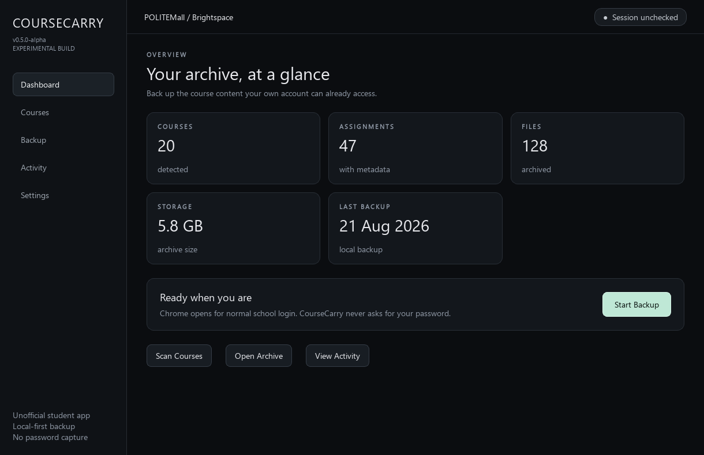
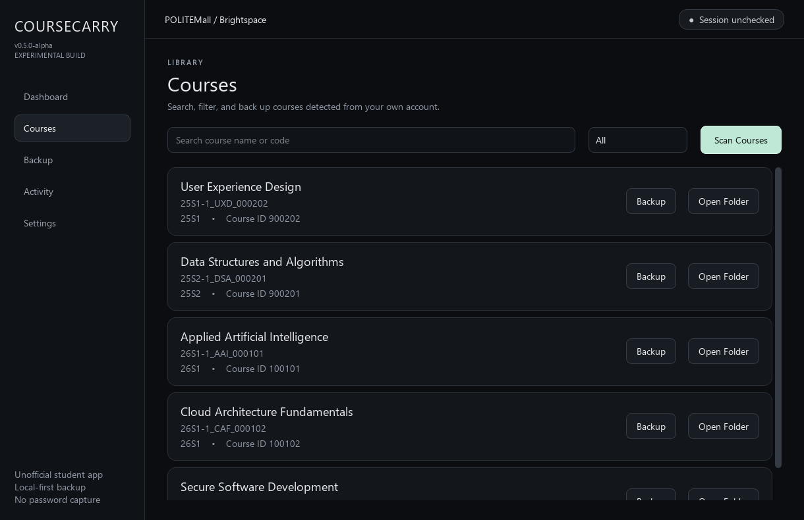
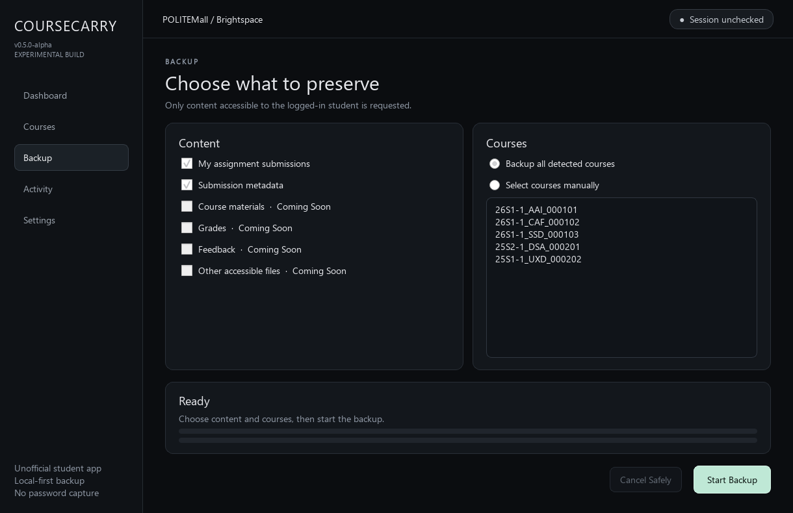
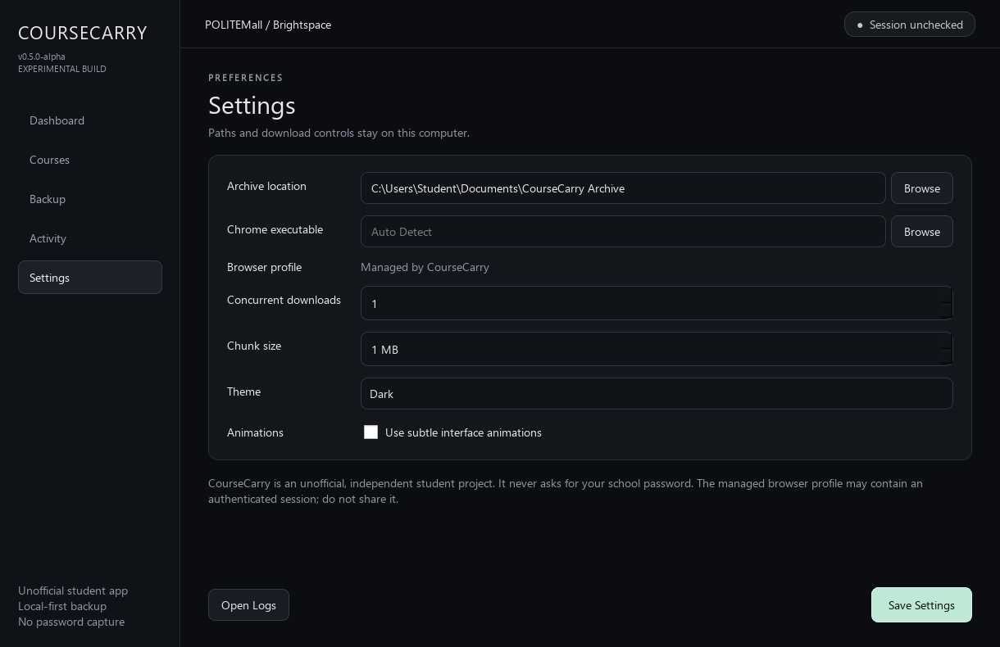

# CourseCarry

An unofficial, local-first POLITEMall / Brightspace backup utility for students.

> [!IMPORTANT]
> **CourseCarry is an independent student project.** It is not affiliated with, authorized by, or endorsed by POLITEMall, D2L, Ngee Ann Polytechnic, or any other Polytechnic.
>
> It only requests content that the signed-in student can already access. Downloaded materials, metadata, and browser-session data stay on the student's computer. Users are responsible for protecting that data and following their institution's policies, platform terms, and copyright rules.

> [!WARNING]
> CourseCarry is experimental alpha software. It is being actively tested against Ngee Ann Polytechnic's POLITEMall / Brightspace environment. Compatibility with other Singapore polytechnics has not been confirmed.

## What it does

CourseCarry is a Windows desktop backup manager for course content and personal assignment submissions. It opens Google Chrome for the institution's normal login flow, scans current and archived courses visible to the signed-in student, and writes an organized offline archive.

It is not a credential collector, access-control bypass, account-sharing tool, or mass-redistribution tool.

## Features

### Implemented in 0.5 alpha

- User-controlled Microsoft / school SSO and MFA in normal Chrome
- Persistent local browser profile; no password field in CourseCarry
- Current and archived POLITEMall course detection
- Personal assignment submission-history scanning
- Authenticated submitted-file downloads
- Large-file streaming in configurable chunks; files are never loaded fully into memory
- `.part` temporary files, final-size verification, bounded retries, and atomic completion
- Duplicate/update decisions using filename, server size, local size, and source URL
- Semester → course → assignment → submission archive structure
- Per-assignment metadata with downloaded, skipped, updated, failed, and incomplete states
- Dashboard, Courses, Backup, Activity, Settings, and first-run onboarding
- Background workers so browser and network work do not freeze the interface
- Daily local logging with credential-like values redacted
- Incremental SQLite backup-run index while retaining `courses.json` compatibility

The provider was migrated from a working prototype. A live end-to-end check against a real account is still required for each alpha release because Brightspace markup and institutional SSO flows can change.

### Coming soon

- Course-material backup
- Grades and feedback backup
- Resume support for interrupted `.part` downloads
- Offline archive search and browsing

The interface labels unimplemented options as **Coming Soon**.

## Screenshots

Screenshots use fake sample course data.

### Dashboard



### Course browser



### Backup configuration and progress



### Settings



## Current status

CourseCarry is `v0.5.0-alpha`. Expect selector breakage, incomplete metadata, and behavior changes. Keep an independent copy of important files and inspect backup results before relying on them.

## Supported / tested institutions

| Institution | Status |
| --- | --- |
| Ngee Ann Polytechnic | Actively tested; initial provider implementation |
| Singapore Polytechnic | Untested |
| Nanyang Polytechnic | Untested |
| Temasek Polytechnic | Untested |
| Republic Polytechnic | Untested |

These rows are not compatibility claims. Other institutions may use different domains, login flows, permissions, or Brightspace configurations.

## Install a Windows release

Requirements:

- 64-bit Windows 10 or Windows 11
- Google Chrome
- Internet connection
- A valid institutional account with normal POLITEMall access

Installation:

1. Download the Windows ZIP from [GitHub Releases](../../releases).
2. Right-click the ZIP, select **Properties**, and choose **Unblock** if Windows shows that option.
3. Select **Extract All**. Do not run the app from inside the ZIP.
4. Open the extracted `CourseCarry` folder and run `CourseCarry.exe`.
5. Keep `CourseCarry.exe` beside its `_internal` folder; moving only the EXE will prevent the app from starting.

Release users do not need to install Python. CourseCarry intentionally uses the locally installed Google Chrome. If Chrome cannot be detected, select `chrome.exe` in Settings.

CourseCarry is currently unsigned, so Windows may show a reputation warning for a new release. Only run downloads obtained from the project's official GitHub Releases page, and never disable security software globally.

## Run from source

```bat
git clone <repository-url>
cd CourseCarry

py -m venv .venv
.venv\Scripts\activate
python -m pip install -r requirements.txt
python main.py
```

Or, after cloning, run:

```bat
setup_windows.bat
run_windows.bat
```

The legacy bulk console command remains available for development:

```bat
python backup_all.py
```

Scan courses in the desktop app first so the local course cache exists.

## Build the Windows app

The alpha build uses PyInstaller `onedir`, which is more reliable for Qt and Playwright assets than `onefile` during development.

```bat
build_exe.bat
```

Output:

```text
dist/
└── CourseCarry/
    ├── CourseCarry.exe
    └── _internal/
```

Distribute the **whole `CourseCarry` folder as a ZIP**, not the EXE by itself. The build script installs development dependencies, runs offline unit tests, cleans old PyInstaller output, and builds [`CourseCarry.spec`](CourseCarry.spec).

## How it works

```text
Launch CourseCarry
→ open a local managed Chrome profile
→ user completes normal SSO / MFA if needed
→ open My Courses and detect current and archived courses
→ scan personal assignment submission history
→ stream each file to filename.part
→ verify its size and atomically rename it
→ write metadata and local backup history
```

Browser and LMS behavior is isolated behind `LMSProvider`; the only current implementation is `NPBrightspaceProvider`. Future providers must be independently tested before support is claimed. See [`docs/architecture.md`](docs/architecture.md).

## Archive structure

```text
CourseCarry Archive/
└── 26S1/
    └── 26S1-1_SAMPLE_000001 [course-123456]/
        └── Assignments/
            └── Week 1 - Sample [assignment-987654]/
                ├── Submission/
                │   └── sample-file.pptx
                └── metadata.json
```

Windows-invalid characters are replaced, components are length-bounded, and stable LMS IDs keep different courses and assignments in different directories. Same-named files in one assignment receive stable numeric suffixes.

## Privacy and data safety

CourseCarry does not ask users to enter their NPNet or Microsoft password into the application. Authentication happens in normal Chrome through the institution's SSO flow. The local browser profile may contain an authenticated session and must be treated as sensitive.

Never share or commit:

- `chrome-profile/` or `browser-data/`
- cookies, tokens, authorization headers, passwords, or MFA codes
- `data/courses.json`, SQLite databases, or their journal/WAL sidecars
- `config.json` when it contains personal paths
- personal course files, submitted assignments, or archive metadata
- logs that have not been reviewed for personal information

The repository ignores these paths and includes [`config.example.json`](config.example.json) and [`data/courses.example.json`](data/courses.example.json) with fake values. Download metadata keeps only a non-reversible source fingerprint, and diagnostics redact credential values, private URL details, and absolute paths. Users should still review diagnostics before sharing them. See [`SECURITY.md`](SECURITY.md) and the [security audit](docs/security-audit.md).

## Intended use and disclaimer

CourseCarry is intended only for personal archival of content that the signed-in user is already authorized to access. It does not grant permission to copy, publish, share, sell, or redistribute course materials.

Do not use CourseCarry to bypass authentication, MFA, SSO, permissions, access restrictions, or institutional controls. Users are responsible for complying with their institution's acceptable-use rules, POLITEMall terms, privacy requirements, and applicable copyright law. The software is provided without warranty under the MIT License.

## Known limitations

- Only NP's observed POLITEMall / Brightspace flow currently has an implementation.
- Brightspace selectors may change without notice.
- Course materials, grades, and feedback are not implemented.
- Interrupted `.part` files are retained as incomplete markers but are not resumed yet.
- Downloads are deliberately sequential to avoid aggressive LMS traffic.
- Browser profile/session data requires the same care as any signed-in browser profile.
- Live authentication and network behavior require manual integration testing; automated tests stay offline.

## Roadmap

### Near-term

- Live regression testing of the renamed desktop build
- More detailed progress and failed-item review
- Resumable interrupted downloads
- Course-material, grade, and feedback backup
- Expanded SQLite assignment/file index
- Improved anonymized diagnostics

### Medium-term

- Backup history and incremental synchronization
- SHA-256 integrity checks
- Offline archive search and course browser
- HTML archive viewer
- Update detection

### Experimental

- Community testing at other Singapore polytechnics
- Generic Brightspace provider
- Selective backup profiles and complete student archive export

## Testing

Run the offline unit suite:

```bat
python -m unittest discover -s tests -v
```

Tests cover semester extraction, filename sanitization and collisions, course/assignment ID parsing, archive paths, duplicate detection, authenticated redirect boundaries, data redaction, and current/archived course parsing. They do not contact POLITEMall.

## Bug reports

Use the anonymized form in [`docs/compatibility-report.md`](docs/compatibility-report.md). Report the institution, LMS hostname, login result, counts rather than names, CourseCarry version, and a redacted error. Never post private account information.

## Contributing

See [`CONTRIBUTING.md`](CONTRIBUTING.md). Provider and selector changes should explain how they were verified, while automated tests must avoid unnecessary LMS traffic.

## Development environment

- Python 3.11+
- PySide6
- Playwright for Python
- Requests
- SQLite from the Python standard library
- PyInstaller for Windows builds

## License

MIT — see [`LICENSE`](LICENSE).
